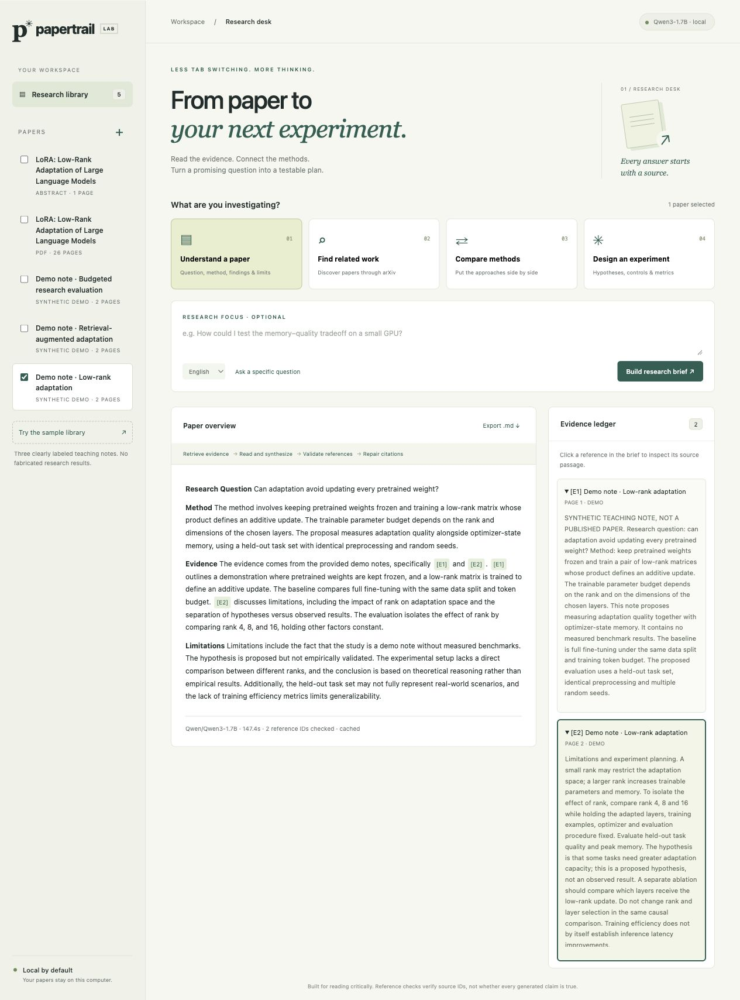
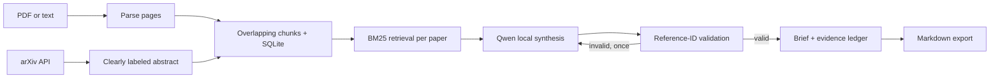

# Papertrail · Research Paper Agent

**From paper to your next experiment. A local-first RAG application for researchers.**

Import a paper, inspect a grounded overview, discover related work, compare approaches, and draft an experiment plan with source passages beside every report. Runs Qwen locally, without paid API keys.



## The research workflow

| Task | What the application does |
|---|---|
| Understand a paper | Retrieves passages and generates a research-question / method / evidence / limitations brief |
| Find related work | Queries the real arXiv API; shows authors, dates, abstracts and original paper links |
| Compare methods | Retrieves evidence separately from each selected paper and asks the model to compare methods and tradeoffs |
| Design an experiment | Drafts untested hypotheses, baselines, ablations, metrics and failure criteria |
| Ask a question | Retrieves matching passages from selected papers and generates a source-linked answer |

The workspace has a persistent paper library, background task progress, clickable reference IDs, an evidence ledger with page numbers, cached reports, and Markdown export. **It is a bounded research workflow, not a general-purpose autonomous agent.** The model cannot execute tools, shell commands or code from a paper.

## Run locally

Python 3.11–3.13. On an 8 GiB Apple Silicon Mac, start with the default small model and CPU dynamic INT8 profile.

```bash
git clone https://github.com/daijunxuan/research-paper-agent.git
cd research-paper-agent
python3 -m venv .venv
source .venv/bin/activate
pip install -e '.[local,dev]'
cp .env.example .env
papertrail
```

Open **http://127.0.0.1:8765**. Choose **Try the sample library** for original, clearly labeled synthetic teaching notes, or import your own text-based PDF. Select papers in the sidebar, choose a research task, then run it. For the sample experiment task, enter a concrete focus such as “Vary adaptation rank and which layers receive the update; hold data and training budget fixed.” The first model request downloads roughly 3.5 GB of public weights if they are not cached. On the measured 8 GiB Mac, analyses take minutes rather than seconds; keep the page open while the local worker runs.

No OpenAI API key, cloud account, frontend build tool, vector database service or Docker daemon is needed. Papers and reports live in `.data/papertrail.sqlite3`; uploaded PDF binaries are not retained. The frontend ships its assets locally and uses no CDN.

After weights are cached, set `HF_HUB_OFFLINE=1` for completely offline local inference. Related-work discovery still needs internet access and sends only your search keywords to arXiv.

### Lightweight evidence-only mode

```bash
pip install -e '.[dev]'
PAPERTRAIL_PROVIDER=evidence papertrail
```

This explicitly labeled baseline returns retrieved source passages and a planning checklist. It does **not** claim to be LLM summarization or generated hypotheses. It makes the complete ingestion, search, citation and export workflow usable without downloading a model.

### Use your existing Ollama installation

```bash
ollama pull qwen2.5:3b
PAPERTRAIL_PROVIDER=ollama PAPERTRAIL_MODEL_ID=qwen2.5:3b papertrail
```

Ollama must already be running on the loopback interface. It is optional and was not installed as part of this project. Larger models may improve instruction following but need more memory and time. This adapter is included; see the validation report for exactly which provider was exercised live.

### Model and memory configuration

The default Qwen3-1.7B revision is pinned to `70d244cc86ccca08cf5af4e1e306ecf908b1ad5e`. Local CPU inference dynamically quantizes linear layers to INT8; other modules remain FP32. Full-precision weights are loaded before quantization, so startup needs more memory than steady-state inference. CUDA/MPS use FP16 and are optional profiles. CUDA was not exercised; MPS was attempted on macOS 13 but did not finish promptly, so CPU remains the tested default.

For a different Hugging Face model, set **both** `PAPERTRAIL_MODEL_ID` and `PAPERTRAIL_MODEL_REVISION` in `.env`. Increasing `PAPERTRAIL_MAX_NEW_TOKENS` produces longer reports at greater latency. `HF_HOME` can point to an existing Hugging Face cache. Models using custom remote code are not enabled.

## How the RAG pipeline works



- **Retrieval:** BM25Plus with lexical-overlap filtering, a lexical cosine tie-breaker, and near-duplicate suppression. The initial implementation deliberately uses a measurable **sparse retriever**, not neural embeddings. Compare tasks reserve evidence slots for each paper.
- **Chunking:** 170-word windows, 35-word overlap, never crossing a page boundary. Reference IDs point to stored chunks with document and page provenance.
- **Generation:** local Qwen generation with a fixed sampling seed; at most one citation-repair attempt. A single worker avoids loading multiple model copies on small machines. The queue is capped at three jobs.
- **Validation:** unknown reference IDs, completely uncited drafts and highly repetitive output are rejected. Comparisons must cite every selected paper. Existing reference IDs do **not** prove factual entailment; users must inspect the passages.
- **Caching:** completed reports are keyed by request, model settings and prompt version. Documents are content-addressed. An Ollama model tag can change behind the same name; start a fresh data directory after changing its weights.
- **Related papers:** real arXiv metadata, not model-invented titles. Requests are serialized with at least 3.1 seconds between calls and a 15-minute cache. Imported abstracts are explicitly distinguished from full-text PDFs.

See [the Chinese guide](docs/README.zh-CN.md) and read [architecture and tradeoffs](docs/architecture.md) and [validation results](docs/validation.md).

## Tests and evaluation

```bash
pytest -q
ruff check .
python scripts/evaluate_retrieval.py
# Optional, with papertrail running: exercise real local generation
python scripts/validate_local.py
```

Tests cover page provenance, chunk overlap, deduplication, blank/encrypted PDFs, irrelevant-query abstention, balanced retrieval, arXiv parsing, citation rejection and bounded repair, task queue limits, report caching, exports and cross-origin write protection. Tests do not download model weights.

Live native-host validation: **35 tests passed**, real LoRA PDF ingestion, real arXiv metadata, and all four local generation tasks exercised. The 1.7B drafts still contain factual imprecision and arbitrary experimental thresholds; the [validation record](docs/validation.md) documents those errors rather than equating citation checks with scientific accuracy.

The retrieval evaluation uses committed synthetic fixtures with known relevant pages. It is a **regression check**, not a benchmark of scientific reasoning. The validation document separately records live PDF parsing, local-model generation, and real arXiv requests. Test counts and metrics are derived from actual runs.

## Docker

```bash
docker build -t papertrail .
docker run --rm -p 127.0.0.1:8765:8765 \
  -v papertrail-data:/app/.data \
  -v papertrail-models:/root/.cache/huggingface \
  papertrail
```

The container is a CPU profile. Use the native macOS installation for the local setup described above. Docker configuration is provided separately from measured native-host validation.

## Limits worth discussing in an interview

1. **Small-model reliability:** a 1.7B model can omit citations, misinterpret a passage or miss a requested section. Bounded repair helps formatting, not scientific correctness. Failed validation never silently becomes a successful report.
2. **Coverage:** the report sees a small set of retrieved passages, not every page. It must not be treated as a complete systematic review.
3. **PDF structure:** tables, math, multi-column order and scanned PDFs need more capable parsing/OCR. Blank pages are flagged; PDF page numbers are physical file pages, not necessarily printed page labels.
4. **Language:** retrieval is lexical. Use keywords in the language of the source. Selecting Chinese output does not provide cross-language semantic retrieval.
5. **Agent scope:** the workflow orchestrates known tools deterministically. It does not autonomously execute proposed experiments or browse arbitrary sites.
6. **Deployment:** this is a single-user local application. No multi-user authentication, distributed queue or tenant isolation is provided. Do not expose it directly to the public internet.

## Project structure

```text
src/paper_agent/
  ingest.py       PDF extraction and page-aware chunking
  retrieval.py    BM25 ranking and per-paper evidence selection
  generation.py   Local Qwen, Ollama, explicit extractive baseline
  agent.py        Bounded orchestration, repair, caching, export
  arxiv.py        Live paper discovery and validated identifiers
  store.py        SQLite documents, chunks and jobs
  app.py          FastAPI routes and local-origin protections
  static/         Responsive research workspace
  fixtures/       Original synthetic teaching notes
tests/            Offline correctness and failure-path tests
scripts/          Reproducible retrieval evaluation
docs/             Architecture, validation and Chinese guide
```

## Sources

- [Qwen3-1.7B model card](https://huggingface.co/Qwen/Qwen3-1.7B)
- [arXiv API manual](https://info.arxiv.org/help/api/user-manual.html)
- [LoRA paper used for local PDF validation](https://arxiv.org/abs/2106.09685)

MIT license covers this application's code and original fixtures. Imported papers and model weights retain their own licenses. Private papers, downloaded weights and local databases are excluded from the repository.
